# LangChain Deep Agents with Box AI - Auto Loan Demo

> **Primary Goal**: Demonstrate how to build sophisticated multi-agent systems using the [LangChain Deep Agents framework](https://docs.langchain.com/docs/deep-agents)
>
> **Secondary Goal**: Show how to integrate [Box AI](https://developer.box.com/guides/box-ai/) capabilities as tools for enterprise content intelligence

This project showcases an **intelligent auto loan underwriting system** that uses a multi-agent orchestrator pattern to make risk-based lending decisions. It demonstrates the full spectrum of automated decision-making from auto-approval to auto-denial, with human review escalation points in between.

## 🎯 What You'll Learn

- **Multi-Agent Orchestration**: How to coordinate specialized sub-agents for complex workflows
- **Tool Integration**: How to wrap external APIs (Box AI) as LangChain tools
- **Persistent Memory**: How to use filesystem-backed memory for agent state
- **Structured Delegation**: How to design task delegation between orchestrator and sub-agents
- **Enterprise Content AI**: How to query and extract data from business documents using Box AI

## 📋 Table of Contents

- [Quick Start](#-quick-start)
- [Box AI Features Used](#-box-ai-features-used)
- [Architecture Overview](#-architecture-overview)
- [Sample Applications](#-sample-applications)
- [Project Structure](#-project-structure)
- [Development](#-development)
- [Documentation](#-documentation)

---

## 🚀 Quick Start

### Prerequisites

- **Python 3.13+** (required by UV and this project)
- **Box Account** with Box AI enabled ([Sign up for free](https://account.box.com/signup/n/developer))
- **Anthropic API Key** ([Get one here](https://console.anthropic.com/))
- *Optional*: **Tavily API Key** for research agent ([Get one here](https://tavily.com/))

### Step 1: Install UV Package Manager

UV is a fast Python package manager that replaces pip and virtualenv. Install it:

**macOS/Linux:**
```bash
curl -LsSf https://astral.sh/uv/install.sh | sh
```

**Windows:**
```powershell
powershell -c "irm https://astral.sh/uv/install.ps1 | iex"
```

**Alternative (via pip):**
```bash
pip install uv
```

Verify installation:
```bash
uv --version
```

> 💡 **Why UV?** UV is 10-100x faster than pip, handles virtual environments automatically, and uses a single `pyproject.toml` for all configuration.

### Step 2: Clone and Setup

```bash
# Clone the repository
git clone https://github.com/yourusername/langchain-box-loan-demo.git
cd langchain-box-loan-demo

# Install dependencies (UV creates .venv automatically)
uv sync

# Activate virtual environment
source .venv/bin/activate  # macOS/Linux
# OR
.venv\Scripts\activate     # Windows
```

### Step 3: Configure Environment Variables

Create your `.env` file from the sample:

```bash
cp sample.env .env
```

Edit `.env` with your credentials:

```env
# Box API Configuration (Required)
# Get these from: https://app.box.com/developers/console
BOX_CLIENT_ID=your_box_client_id_here
BOX_CLIENT_SECRET=your_box_client_secret_here
BOX_SUBJECT_TYPE=enterprise              # or "user" for user-level auth
BOX_SUBJECT_ID=your_box_subject_id_here  # Enterprise ID or User ID
BOX_DEMO_PARENT_FOLDER=0                 # Box folder ID (0 = root folder)
BOX_DEMO_FOLDER_NAME=LoanApplications    # Name of demo folder to create

# Anthropic API Configuration (Required)
ANTHROPIC_API_KEY=your_anthropic_api_key_here

# Optional: For research agent with web search
TAVILY_API_KEY=your_tavily_api_key_here

# Optional: For LangSmith tracing and evaluation
LANGSMITH_API_KEY=your_langsmith_api_key_here
LANGSMITH_TRACING=true
LANGSMITH_PROJECT=langchain-box-loan-demo

# Logging Configuration (Optional)
LOG_LEVEL=INFO
# LOG_FILE=/path/to/logfile.log  # Uncomment to enable file logging
```

> 📚 **Box Setup Guide**: See [Box CCG Authentication Setup](https://developer.box.com/guides/authentication/client-credentials/client-credentials-setup/) for detailed instructions on creating a Box app and getting credentials.

### Step 4: Upload Sample Data to Box

The demo requires loan application documents to be uploaded to Box:

```bash
uv run src/demo_upload_sample_data.py
```

This uploads the `data/` folder contents to Box and creates a cache file at `agents_memories/box_upload_cache.json` with folder/file IDs.

### Step 5: Run the Demo

The demo script allows you to process individual loans or all of them at once. By default, it processes a single applicant (David Martinez - high risk case).

**Run the default demo:**
```bash
uv run src/demo_loan.py
```

**Choose which loans to process:**

Edit [src/demo_loan.py](src/demo_loan.py) and uncomment the desired option at the bottom of the file:

```python
if __name__ == "__main__":
    # Option 1: Run a single applicant (uncomment one):
    # asyncio.run(test_loan_application("Sarah Chen"))      # Perfect borrower ✅
    # asyncio.run(test_loan_application("Marcus Johnson"))  # Borderline case ⚠️
    asyncio.run(test_loan_application("David Martinez"))   # High risk 🚨 (default)
    # asyncio.run(test_loan_application("Jennifer Lopez"))  # Auto-deny 🚫

    # Option 2: Run all four applicants sequentially:
    # asyncio.run(main())
```

**What you'll see:**

The orchestrator processes the loan application through multiple sub-agents, with real-time streaming of:
- Agent thoughts and strategic planning
- Tool calls to Box AI (search, list, ask, extract)
- Sub-agent delegations and responses
- Risk calculations and policy interpretations
- Final underwriting decision with detailed reasoning

**Expected Outcomes by Applicant:**
- ✅ **Sarah Chen**: AUTO-APPROVE (750 credit, 12.1% DTI, zero violations)
- ⚠️ **Marcus Johnson**: HUMAN REVIEW (680 credit, 42.1% DTI, borderline case)
- 🚨 **David Martinez**: ESCALATION REQUIRED (640 credit, 47% DTI, 2 violations)
- 🚫 **Jennifer Lopez**: AUTO-DENY (575 credit, 54.7% DTI, major violations)

> 💡 **Tip**: Run `asyncio.run(main())` to process all four applicants in sequence and see the complete decision spectrum.

---

## 📦 Box AI Features Used

This project demonstrates integration with **5 key Box AI capabilities** through the [`box-ai-agents-toolkit`](https://github.com/box/box-ai-agents-toolkit) package:

| Box AI Feature | Tool Wrapper | Agent | Purpose |
|----------------|--------------|-------|---------|
| **[Box AI Ask](https://developer.box.com/guides/box-ai/ai-ask/)** | `ask_box_ai_about_loan()` | `box-extract-agent`<br>`policy-agent` | Query documents with natural language questions<br>*(e.g., "What is the applicant's monthly income?")* |
| **[Box AI Extract](https://developer.box.com/guides/box-ai/ai-extract/)** | `extract_structured_loan_data()` | `box-extract-agent` | Extract structured data with field definitions<br>*(e.g., credit score, income, employment details)* |
| **[Folder Search](https://developer.box.com/guides/search/)** | `search_loan_folder()` | `box-extract-agent` | Locate folders by name within parent folder |
| **[Folder Items List](https://developer.box.com/reference/get-folders-id-items/)** | `list_loan_documents()` | `box-extract-agent` | List all files and subfolders in a folder |
| **[File Upload](https://developer.box.com/reference/post-files-content/)** | `upload_text_file_to_box()` | `loan-orchestrator` | Upload agent-generated reports to Box |

### Tool Implementation Pattern

All Box AI features are wrapped as **LangChain tools** using the `@tool` decorator:

```python
from langchain_core.tools import tool
from box_ai_agents_toolkit import box_ai_ask_file_multi

@tool(parse_docstring=True)
def ask_box_ai_about_loan(folder_id: str, question: str) -> str:
    """Ask Box AI a question about documents in a loan application folder.

    Args:
        folder_id: Box folder ID containing the loan application
        question: Question to ask about the loan application

    Returns:
        Box AI's response with information from the documents
    """
    # Get all file IDs from folder
    file_ids = get_file_ids_from_folder(folder_id)

    # Query Box AI
    ai_response = box_ai_ask_file_multi(
        client=box_client,
        file_ids=file_ids,
        prompt=question
    )

    return format_response(ai_response)
```

**See:** [src/agents/loan_underwriting/loan_tools.py](src/agents/loan_underwriting/loan_tools.py) for complete implementations

---

## 🏗️ Architecture Overview

### Multi-Agent System Design

The system uses a **hierarchical orchestrator pattern** where a main orchestrator coordinates three specialized sub-agents:

```mermaid
graph TD
    User[User Request] --> Orch[Loan Orchestrator<br/>Claude Sonnet 4.5]

    Orch -->|1. Extract Data| Extract[Box Extract Agent<br/>Document Intelligence]
    Orch -->|2. Check Policies| Policy[Policy Agent<br/>Compliance Rules]
    Orch -->|3. Calculate Risk| Risk[Risk Calculation Agent<br/>Quantitative Analysis]

    Extract -->|Box AI Tools| BoxData[Box AI Ask<br/>Box AI Extract<br/>Folder Search]
    Policy -->|Box AI Tools| BoxPolicy[Box AI Ask<br/>Policy Documents]
    Risk -->|Calculation Tools| Calc["calculate<br/>think_tool"]

    Extract -.->|Data Report| Mem[Persistent Memory<br/>agents_memories/]
    Policy -.->|Policy Report| Mem
    Risk -.->|Risk Report| Mem

    Mem -.->|Read Reports| Orch
    Orch -->|Decision Report| BoxUpload[Upload to Box]
    Orch --> Decision{Decision Outcome}

    Decision -->|Zero Violations| Approve[✅ AUTO-APPROVE]
    Decision -->|Minor Violations| Review[⚠️ HUMAN REVIEW]
    Decision -->|Moderate Violations| Escalate[🚨 ESCALATION REQUIRED]
    Decision -->|Major Violations| Deny[🚫 AUTO-DENY]

    style Orch fill:#4A90E2,color:#fff
    style Extract fill:#7ED321,color:#000
    style Policy fill:#F5A623,color:#000
    style Risk fill:#BD10E0,color:#fff
    style Mem fill:#B8E986,color:#000
    style BoxData fill:#0061D5,color:#fff
    style BoxPolicy fill:#0061D5,color:#fff
```



### Agent Responsibilities

| Agent | Role | Tools | Outputs |
|-------|------|-------|---------|
| **Loan Orchestrator**<br/>[src/agents/loan_orchestrator.py](src/agents/loan_orchestrator.py) | Coordinates workflow<br/>Makes final decision | `upload_text_file_to_box()`<br/>`task()` (sub-agent delegation) | `{applicant}_underwriting.md`<br/>`{applicant}_underwriting_decision.md` |
| **Box Extract Agent**<br/>[src/agents/loan_underwriting/loan_tools.py](src/agents/loan_underwriting/loan_tools.py) | Retrieves loan application data | `search_loan_folder()`<br/>`list_loan_documents()`<br/>`ask_box_ai_about_loan()`<br/>`extract_structured_loan_data()` | `{applicant}_data_extraction.md` |
| **Policy Agent**<br/>[src/agents/loan_underwriting/loan_tools.py](src/agents/loan_underwriting/loan_tools.py) | Interprets underwriting policies | `ask_box_ai_about_loan()` | `{applicant}_policy.md` |
| **Risk Calculation Agent**<br/>[src/agents/loan_underwriting/loan_tools.py](src/agents/loan_underwriting/loan_tools.py) | Performs quantitative analysis | `calculate()`<br/>`think_tool()` | `{applicant}_risk_calculation.md` |

### Persistent Memory Architecture

Agents use a **composite backend** that combines in-memory state with filesystem persistence:

```python
from deepagents.backends import CompositeBackend, FilesystemBackend, StateBackend

def backend(rt):
    return CompositeBackend(
        default=StateBackend(rt),  # In-memory for conversation state
        routes={
            "/memories/": filesystem_backend,  # Persistent files for reports
        },
    )
```

**Memory Layout:**
```
agents_memories/
├── box_upload_cache.json          # Box folder/file ID cache
└── {Applicant Name}/               # Per-applicant memory
    ├── {applicant}_data_extraction.md
    ├── {applicant}_policy.md
    ├── {applicant}_risk_calculation.md
    ├── {applicant}_underwriting_decision.md
    └── {applicant}_underwriting.md
```

Sub-agents write reports to virtual paths like `/memories/Sarah Chen/Sarah Chen_data_extraction.md`, which map to real filesystem paths.

### Deep Agents Framework Features Used

| Feature | Usage in This Project |
|---------|----------------------|
| **Multi-Agent Orchestration** | Main orchestrator delegates to 3 specialized sub-agents |
| **Tool Integration** | 8+ LangChain tools wrapping Box AI and calculation functions |
| **Persistent Memory** | Filesystem backend stores agent reports across sessions |
| **Structured Delegation** | `task()` tool with clear task descriptions and agent assignments |
| **Streaming Responses** | Real-time agent thoughts and actions via `stream_agent()` |
| **State Management** | Composite backend routes memory to appropriate storage |

**Deep Agents Documentation:** [https://docs.langchain.com/docs/deep-agents](https://docs.langchain.com/docs/deep-agents)

---

## 📊 Sample Applications

The demo includes **4 complete loan applications** representing the full decision spectrum:

### 1. Sarah Chen ✅ (Auto-Approve)
- **Profile**: Perfect borrower, zero violations
- **Credit Score**: 750 (excellent)
- **DTI Ratio**: 12.1% (well below 40% threshold)
- **Income**: $7,500/mo, 5 years at employer
- **Vehicle**: 2024 Honda Accord (new), $27,000
- **Decision**: AUTO-APPROVE with prime rate pricing

### 2. Marcus Johnson ⚠️ (Human Review)
- **Profile**: Borderline case, requires senior underwriter review
- **Credit Score**: 680 (good)
- **DTI Ratio**: 42.1% (borderline, just under 43% violation threshold)
- **Income**: $5,200/mo, stable employment
- **Vehicle**: 2021 Toyota Camry (used), $22,000
- **Decision**: HUMAN REVIEW (senior underwriter approval)

### 3. David Martinez 🚨 (Escalation Required)
- **Profile**: High-risk case with multiple concerns
- **Credit Score**: 640 (fair)
- **DTI Ratio**: 47.0% (moderate violation, >43%)
- **LTV Ratio**: 107% (minor violation, negative equity)
- **Income**: $4,800/mo, employment concerns
- **Vehicle**: 2019 Honda Civic (used), $18,000
- **Decision**: ESCALATION REQUIRED (regional director approval)

### 4. Jennifer Lopez 🚫 (Auto-Deny)
- **Profile**: Unacceptable risk with major violations
- **Credit Score**: 575 (major violation, <600)
- **DTI Ratio**: 54.7% (major violation, >48%)
- **Income**: $3,800/mo, unstable employment
- **Vehicle**: 2022 Nissan Altima (used), $20,000
- **History**: Recent repossession, multiple collections
- **Decision**: AUTO-DENY (automatic system rejection)

**All sample data is completely fictional and marked as "DEMO DATA" for testing purposes only.**

---

## 📁 Project Structure

```
langchain-box-loan-demo/
├── src/                              # Application source code
│   ├── agents/                       # Deep Agents implementations
│   │   ├── loan_underwriting/       # Loan agent module
│   │   │   ├── __init__.py          # Module exports
│   │   │   ├── loan_prompts.py      # System prompts for orchestrator & sub-agents
│   │   │   └── loan_tools.py        # LangChain tool wrappers for Box AI
│   │   ├── research_agent/          # Research agent (reference implementation)
│   │   │   ├── __init__.py
│   │   │   ├── research_prompts.py
│   │   │   └── research_tools.py
│   │   ├── loan_orchestrator.py     # Loan orchestrator factory
│   │   └── orchestrator_research.py # Research orchestrator factory
│   ├── utils/                       # Shared utilities
│   │   ├── box_api_auth.py          # Box CCG authentication
│   │   ├── box_api_generic.py       # Box API helper functions
│   │   ├── display_messages.py      # Agent message streaming
│   │   └── logging_config.py        # Centralized logging
│   ├── app_config.py                # Pydantic settings configuration
│   ├── demo_loan.py                 # Loan orchestrator demo
│   ├── demo_research.py             # Research agent demo
│   └── demo_upload_sample_data.py   # Box data upload utility
│
├── data/                            # Sample loan data (local copies)
│   ├── Applications/                # Four complete loan applications
│   │   ├── Sarah Chen/
│   │   │   └── Sarah Documents/    # Applicant documents (PDFs)
│   │   ├── Marcus Johnson/
│   │   │   └── Marcus Documents/
│   │   ├── David Martinez/
│   │   │   └── David Documents/
│   │   └── Jennifer Lopez/
│   │       └── Jenifer Documents/
│   ├── Demo Goal Samples/          # Quick reference documentation
│   │   ├── QUICK_REFERENCE_*.md   # Per-applicant summaries
│   │   └── ULTIMATE_SUMMARY.md    # Complete dataset overview
│   └── Policies/                   # Underwriting policy documents
│       ├── Auto Loan Underwriting Standards.md
│       ├── Exception Approval Authority.md
│       └── Vehicle Valuation Guidelines.md
│
├── agents_memories/                # Agent persistent memory
│   ├── box_upload_cache.json      # Box upload tracking
│   └── {Applicant Name}/          # Per-applicant memory folders
│
├── docs/                           # Documentation
│   ├── deep-agents-framework.md   # LangChain Deep Agents guide
│   ├── box-ai-agents-toolkit.md   # Box AI Agents Toolkit reference
│   └── utilities.md               # Utilities module reference
├── tests/                          # Test suite
├── .venv/                          # Virtual environment (created by uv)
├── pyproject.toml                  # UV project configuration
├── sample.env                      # Environment variables template
├── .env                           # Your local environment (gitignored)
├── README.md                       # This file
└── CLAUDE.md                       # Project guidance for Claude Code
```

---

## 🛠️ Development


### Code Quality

This project uses [Ruff](https://docs.astral.sh/ruff/) for linting and formatting:

```bash
# Check for linting issues
ruff check .

# Auto-fix issues
ruff check --fix .

# Format code
ruff format .
```

### Adding Dependencies

Use UV to add new packages:

```bash
# Add a runtime dependency
uv add package-name

# Add a development dependency
uv add --dev package-name

# Update all dependencies
uv sync
```

### Environment Management

```bash
# Create/recreate virtual environment
uv venv

# Install dependencies
uv sync

# Run a script without activating venv
uv run src/demo_loan.py

# Install a package temporarily (doesn't modify pyproject.toml)
uv pip install package-name
```

### Logging Configuration

Configure logging via environment variables:

```env
LOG_LEVEL=DEBUG              # DEBUG, INFO, WARNING, ERROR, CRITICAL
LOG_FILE=/path/to/app.log   # Optional: log to file
```

Logs include:
- Agent orchestrator decisions
- Sub-agent delegations and responses
- Box API calls and responses
- Tool executions and results
- Error stack traces

---

## 📚 Documentation

This project includes comprehensive documentation covering all major components:

### [Deep Agents Framework Guide](docs/deep-agents-framework.md)

Complete guide to LangChain's Deep Agents framework as used in this project:
- **Overview** - What Deep Agents are and core philosophy
- **Key Concepts** - Orchestrators, sub-agents, backends, and memory management
- **Creating Deep Agents** - Factory function patterns and configuration
- **Tool Integration** - LangChain tool patterns and categories
- **Sub-Agent Delegation** - How delegation works and best practices
- **Memory Management** - Virtual paths, persistent storage, and cleanup
- **Advanced Features** - Model configuration, parallel execution, reflection tools

### [Box AI Agents Toolkit Reference](docs/box-ai-agents-toolkit.md)

Complete reference for the `box-ai-agents-toolkit` library:
- **What This Project Uses** - Box AI functions, search, file operations, authentication
- **Library Organization** - Module structure and function categories
- **Complete Function Reference** - All 150+ functions with signatures and examples
- **Integration with LangChain** - How toolkit functions are wrapped as LangChain tools
- **Error Handling** - Response formats and error patterns
- **Usage Examples** - Practical examples of common operations

### [Utilities Reference](docs/utilities.md)

Detailed reference for utility modules in `src/utils/`:
- **box_api_auth.py** - Box CCG authentication with token persistence
- **box_api_generic.py** - Custom file/folder operations, pre-flight checks, recursive uploads
- **display_messages.py** - Agent message streaming and rich terminal formatting
- **logging_config.py** - Centralized colored logging configuration
- **Common Patterns** - Integration examples and typical usage workflows

---

## 📚 Additional Resources

### LangChain Deep Agents
- [Deep Agents Documentation](https://docs.langchain.com/docs/deep-agents)
- [LangGraph Documentation](https://langchain-ai.github.io/langgraph/)
- [LangChain Tools Guide](https://python.langchain.com/docs/modules/agents/tools/)

### Box AI & APIs
- [Box AI Overview](https://developer.box.com/guides/box-ai/)
- [Box AI Ask API](https://developer.box.com/guides/box-ai/ai-ask/)
- [Box AI Extract API](https://developer.box.com/guides/box-ai/ai-extract/)
- [Box CCG Authentication](https://developer.box.com/guides/authentication/client-credentials/)
- [box-ai-agents-toolkit on GitHub](https://github.com/box/box-ai-agents-toolkit)

### Related Projects
- [LangChain](https://github.com/langchain-ai/langchain)
- [Anthropic Claude](https://www.anthropic.com/claude)
- [UV Package Manager](https://github.com/astral-sh/uv)

---

## 🤝 Contributing

Contributions are welcome! Please feel free to submit a Pull Request. For major changes, please open an issue first to discuss what you would like to change.

---

## 📝 License

This project is licensed under the MIT License - see the LICENSE file for details.

---

## 🙏 Acknowledgments

- Built with [LangChain Deep Agents](https://docs.langchain.com/docs/deep-agents)
- Powered by [Anthropic Claude](https://www.anthropic.com/claude)
- Enterprise content intelligence by [Box AI](https://www.box.com/ai)
- Package management by [UV](https://github.com/astral-sh/uv)

---

**Questions or Issues?** Please open an issue on GitHub or reach out to the maintainers.
